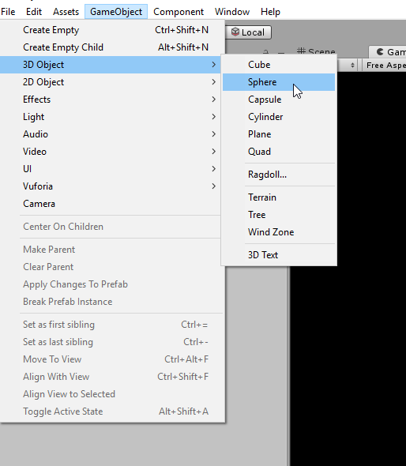
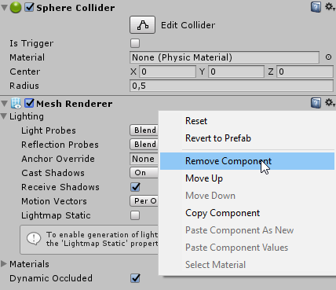
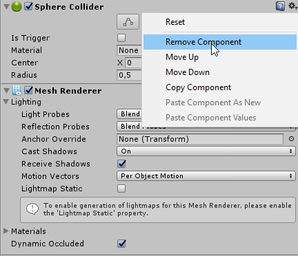

# Creating your first Entity  
## Overview  
Entities are the cornerstone of DuneNet, allowing for dynamic objects to be created and destroyed at runtime and be synchronized to all connected and ready clients.  
In this example, we will create our first entity and have it move around a bit to get used to entity oriented development.  
Entities are composed of two classes that derive from [``Client.Entities.Entity``](../../api/DuneNet.Client.Entities.Entity.html) and [``Server.Entities.Entity``](../../api/DuneNet.Server.Entities.Entity.html), representing the clientside and serverside parts of the entity respectively.
  
As with previous examples, we will first provide the whole code for the example and then we will explain the important aspects of it.

*Assets/Scripts/Server/Entities/ServerAwesomeSphere.cs:*  
```csharp
using DuneNet.Server;
using DuneNet.Server.Entities;
using DuneNet.Shared.Entities;
using DuneNet.Shared.Enums;
using UnityEngine;

namespace Server.Entities
{
    [EntityReg("awesome_sphere", "Server/Entities/awesome_sphere_prefab", NetworkContext.Server)]
    public class ServerAwesomeSphere : DuneNet.Server.Entities.Entity
    {
        private float _lifeTime;
        
        protected override void OnEntitySpawned()
        {
            _lifeTime = 20f;
            SetPos(new Vector3(EntId ?? 0, 10, 0));
            NetworkedPositionAndRotation = true;
            Debug.Log(name + " just popped into existence and is of type " + EntName + "!");
        }

        protected override void OnUpdate()
        {
            _lifeTime -= Time.deltaTime;
            
            if (_lifeTime > 0) return;

            if (EntId.HasValue)
            {
                Debug.Log(name + " with id " + (EntId ?? 0) + " has just died :(");
            }
            
            DuneServer.EntityController.DestroyEntity(this);
        }

        protected override void OnFixedUpdate()
        {
            transform.position = new Vector3(transform.position.x, Mathf.Sin(Time.time) * 2.5f, transform.position.z);
        }

        protected override void OnNetUpdate()
        {
            SetNetworkedVar("lifeTime", _lifeTime);
        }
    }
}
```

*Assets/Scripts/Client/Entities/ClientAwesomeSphere.cs:*  
```csharp
using DuneNet.Client.Entities;
using DuneNet.Shared.Entities;
using DuneNet.Shared.Enums;
using UnityEngine;

namespace Client.Entities
{
    [EntityReg("awesome_sphere", "Client/Entities/awesome_sphere_prefab", NetworkContext.Client)]
    public class ClientAwesomeSphere : DuneNet.Client.Entities.Entity
    {
        private float _lifeTime;
        
        protected override void OnEntitySpawned()
        {
            Debug.Log(name + " just popped into existence and is of type " + EntName + "!");

            GetComponent<MeshRenderer>().material.color = HasAuthority ? new Color(0f, 1f, 0f) : new Color(1f, 0f, 0f);
        }

        protected override void OnLateUpdate()
        {
            Debug.Log(name + " only has " + _lifeTime + " seconds of life :S");
        }

        protected override void OnEntityDestroyed()
        {
            if (!EntId.HasValue) return;
            Debug.Log("Poor entity " + name + " with id " + (EntId ?? 0) + " has died :((((");
        }

        protected override void OnSetNetVar(string varName)
        {
            switch (varName)
            {
                case "lifeTime":
                    _lifeTime = GetNetworkedVar<float>("lifeTime");
                    break;
            }
        }
    }
}
```  

## ServerAwesomeSphere.cs  
First of all, we define a new class that derives from [``Entity``](../../api/DuneNet.Server.Entities.Entity.html):  
```csharp
public class ServerAwesomeSphere : DuneNet.Server.Entities.Entity
```  
The [``Entity``](../../api/DuneNet.Server.Entities.Entity.html) class provides many overridable methods that we can use to add functionality to our entities.  

The first method we will override is ``OnEntitySpawned()``. This method is called when the entity is spawned and it is the perfect place to initialize any entity properties and perform any kind of initialization that might be required.
```csharp
protected override void OnEntitySpawned()
{
    _lifeTime = 20f;
    SetPos(new Vector3(EntId ?? 0, 10, 0));
    NetworkedPositionAndRotation = true;
    Debug.Log(name + " just popped into existence and is of type " + EntName + "!");
}
```  
In our case, we initialize the ``_lifeTime`` property to a sensible value like ``20f`` and we set its position to ``10`` units above the scene center and as many units to the right as the id of the entity by using the ``EntId`` inherited property.  
We also set the ``NetworkedPositionAndRotation`` property to true, which instructs DuneNet to automatically synchronize the movement of the entity to the clients.  
Finally, we print a nice debug message to the console showing the name of the entity's GameObject (``name``) and the registration name of the entity (``EntName``).  

In order to make the entity die after a period of time, we will also overwrite the ``OnUpdate()`` method.  
```csharp
protected override void OnUpdate()
{
    _lifeTime -= Time.deltaTime;
    
    if (_lifeTime > 0) return;

    if (EntId.HasValue)
    {
        Debug.Log(name + " with id " + (EntId ?? 0) + " has just died :(");
    }
    
    DuneServer.EntityController.DestroyEntity(this);
}
```  
First, we subtract the time spent rendering the last frame from our ``_lifeTime`` counter and then we return if the value is bigger than 0. This means the entity is not ready to die yet (yay!).  
If the value is equal or smaller than 0, it means than the entity has to die, so we first check that this is indeed a networked entity by making sure ``EntId`` has a value and then we print a nice debug message to the console showing the entity's GameObject name and its ID.  
Finally, we destroy the entity by calling ``DuneServer.EntityController.DestroyEntity()`` with this entity as a argument.  

Another method we might want to override is ``OnFixedUpdate()``. This method is called every physics tick, so it is perfect to perform any movement operation.  
```csharp
protected override void OnFixedUpdate()
{
    transform.position = new Vector3(transform.position.x, Mathf.Sin(Time.time) * 2.5f, transform.position.z);
}
```  
We want to make our entity oscillate between ``2.5f`` and ``-2.5f`` so we modify it's position's ``y`` position to be the Sinus of the current time and we multiply it by ``2.5f``.  

Since we want to inform the clients about the entity's lifetime, we will also synchronize the ``_lifeTime`` property by overriding the ``OnNetUpdate()`` method and using a Networked Variable.  
```csharp
protected override void OnNetUpdate()
{
    SetNetworkedVar("lifeTime", _lifeTime);
}
```  
The ``OnNetUpdate()`` method is called every network tick, so it is the perfect place to set Networked Variables or User Messages (the inverse of Networked Variables).  
Networked Variables are simply variables that are synchronized from the server to all clients that can observe this entity (ie, entities that are currently spawned on the client).  
Here, we use the ``SetNetworkedVar()`` method to assign the ``lifeTime`` Networked Variable to the value of ``_lifeTime`` on every network tick.  
Setting Networked Variables outside of ``OnNetUpdate()``, while possible, is not recommended since the variables will only be networked on every network tick if the value has changed. We recommend using class properties to store the actual value of the variable and then synchronizing that value on the network tick if such thing is necessary (sometimes you might not want to synchronize a Networked Variable on every tick but only when it's needed).

Finally, we register the entity with DuneNet by attaching the ``EntityReg`` attribute to the class of the entity.  
```csharp
[EntityReg("awesome_sphere", "Server/Entities/awesome_sphere_prefab", NetworkContext.Server)]
public class ServerAwesomeSphere : DuneNet.Server.Entities.Entity
```  
The ``EntityReg`` attribute takes three arguments in its constructor: the registration name of the entity (this is what we will use to spawn it and must be equal between server and client for the same entity), the relative path to the entity's prefab starting from ``Resources/`` and the context the entity is valid for, either ``NetworkContext.Server`` or ``NetworkContext.Client``.  

## ClientAwesomeSphere.cs  
First of all, we define a new class that derives from [``Entity``](../../api/DuneNet.Client.Entities.Entity.html):  
```csharp
public class ClientAwesomeSphere : DuneNet.Client.Entities.Entity
```  
The first method we will override is ``OnEntitySpawned()``. This method is called when the entity is spawned and it is the perfect place to initialize any entity properties and perform any kind of initialization that might be required.
```csharp
protected override void OnEntitySpawned()
{
    Debug.Log(name + " just popped into existence and is of type " + EntName + "!");

    GetComponent<MeshRenderer>().material.color = HasAuthority ? new Color(0f, 1f, 0f) : new Color(1f, 0f, 0f);
}
```  
First, we print a debug message to the console showing the entity's GameObject name and its registration name.  
After that, we paint the entity's ``MeshRenderer`` green if the client has authority over the entity or red otherwise. More on entity authority later.  

We want to display the lifetime of the entity so we override the ``OnLateUpdate()`` method. While this can also be done on the ``OnUpdate()`` method, in this example we want the message to be printed after the current frame has finished rendering for demonstration purposes.  
```csharp
protected override void OnLateUpdate()
{
    Debug.Log(name + " only has " + _lifeTime + " seconds of life :S");
}
```  
In this method, we print a simple debug message to show the current lifetime of the entity by using the entity's GameObject name, as well as the ``_lifeTime`` property that we will synchronize down below.  

We also want to show a nice message when the entity is destroyed so we override the ``AAA`` method.  
```csharp
protected override void OnEntityDestroyed()
{
    if (!EntId.HasValue) return;
    Debug.Log("Poor entity " + name + " with id " + (EntId ?? 0) + " has died :((((");
}
```  
The first thing we do is check if the entity is networked by making sure the ``EntId`` inherited property has a value and then we print a nice debug message to the console by using the entity's GameObject name and its entity ID.  

As stated before, we want to we want to update the value of the ``_lifeTime`` property with the value of the entity's current lifetime. In order to do this, we must overwrite the ``OnSetNetVar()`` method.  
```csharp
protected override void OnSetNetVar(string varName)
{
    switch (varName)
    {
        case "lifeTime":
            _lifeTime = GetNetworkedVar<float>(varName);
            break;
    }
}
```  
The ``OnSetNetVar()`` method is called each time the server updates any of the Networked Variables of the entity and it provides us with the name of the Networked Variable that triggered the call.  
We can easily use this information to retrieve the Networked Variable's value by using the ``GetNetworkedVar<T>()`` method. This method takes the name of the Networked Variable as argument and its type as generics type. The type of the Networked Variable is known beforehand, since it is the same type as the value we set with ``SetNetworkedVar()``.  
In this example, we use the value of ``GetNetworkedVar<T>()`` to store the value of the ``lifeTime`` Networked Variable into the ``_lifeTime`` property. We use a switch here since we can expect to check the same variable against multiple values, but feel free to use the conditional structure of your choice.  

Finally, we register the entity with DuneNet by attaching the ``EntityReg`` attribute to the class of the entity.  
```csharp
[EntityReg("awesome_sphere", "Client/Entities/awesome_sphere_prefab", NetworkContext.Client)]
public class ClientAwesomeSphere : DuneNet.Client.Entities.Entity
```  
The ``EntityReg`` attribute takes three arguments in its constructor: the registration name of the entity (this is what we will use to spawn it and must be equal between server and client for the same entity), the relative path to the entity's prefab starting from ``Resources/`` and the context the entity is valid for, either ``NetworkContext.Server`` or ``NetworkContext.Client``.  

## Creating the entity prefabs  
An important component of an entity is its prefab.  
The entity's prefab is its physical representation in scene and we need two of them per entity, one for the server and one for the client. This allows us to remove unneeded components from each network context (for example, we don't need a ``MeshRenderer`` on the server or a ``Collider`` on the client).  

For this example, we will create two prefabs representing a sphere.

### Server prefab  
First, we create a simple Sphere GameObject:  
<div style="text-align:center">
    
</div>

Then we remove the ``MeshRenderer`` component from the GameObject since we don't need it on the server (we generally want to avoid rendering on the server).  
<div style="text-align:center">
    
</div>

And finally we save the GameObject as a prefab named ``awesome_sphere_prefab`` inside the ``Assets/Resources/Server/Entities/`` folder.

### Client prefab  
First, we create a simple Sphere GameObject:  
<div style="text-align:center">
    
</div>

Then we remove the ``SphereCollider`` component from the GameObject since we don't need it on the client (it is not recommended to have any kind of physics components on the client unless you are attempting to implement your own client prediction).  
<div style="text-align:center">
    
</div>

And finally we save the GameObject as a prefab named ``awesome_sphere_prefab`` inside the ``Assets/Resources/Client/Entities/`` folder.

## Spawning the entity  
Now that we have defined our entity, it is time to spawn it.  
For our example, we will create a new [DuneModule](../../api/DuneNet.Server.DuneModule.html):  
```csharp
using DuneNet.Server;
using DuneNet.Shared;

namespace Server.Modules
{
    public class WelcomeEntitySpawner : DuneNet.Server.DuneModule
    {
        protected override void OnNetReady(DuneConnection conn)
        {
            DuneServer.EntityController.SpawnEntity("awesome_sphere", conn);
        }
    }
}
```  
This is a serverside module that will spawn a new ``awesome_sphere`` entity every time a client becomes ready.  
For this, we use the overload of ``SpawnEntity()`` that takes a ``DuneConnection`` object as argument, as well as the registration name of the entity. This overload will spawn the entity with authority for the connection that we provide as argument.  
Having authority over an entity means the authoritative connection will be able to set User Messages for it. This ensures that clients can only send information to the server for entities they have authority over. Generally, this is used for capturing player input from a designated player entity but it can also be used in creative ways like we did above.  

Finally, we just need to register the module we have created as in previous examples.  
```csharp
DuneServer.Use(new WelcomeEntitySpawner());
```

## What's next?  
With the knowledge from this example and some digging of the [``Client.Entities.Entity``](../../api/DuneNet.Client.Entities.Entity.html), [``Server.Entities.Entity``](../../api/DuneNet.Server.Entities.Entity.html), [``Client.Controllers.EntityController``](../../api/DuneNet.Client.Controllers.EntityController.html) and [``Server.Controllers.EntityController``](../../api/DuneNet.Server.Controllers.EntityController.html) classes, you should now be able to give life to your multiplayer games by leveraging the power of entities.  
In the [next example](example-5.md), we will learn how to use events to effectively trigger global actions on both the server and the client.