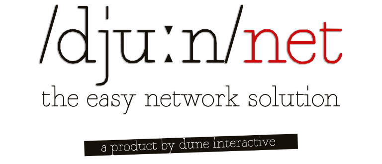

    

DuneNet *(stylized as /djuːn/net)* is a complete network solution for building server authoritative games on top of the Unity Engine.

With powerful networking, entity, event and module frameworks, DuneNet allows you to focus on making awesome multiplayer games without having to worry about dealing with the annoyances of UNET.

## Table of contents

  * [Installation](#installation)
     * [Asset Store](#asset-store)
     * [Manually](#manually)
  * [Design principles](#design-principles)
  * [Getting Started](#getting-started)
  * [Components](#components)
  * [Examples](#examples)
     * [Connecting a client to a server for the first time](documentation/getting-started/example-1.md)
     * [Displaying new connections](documentation/getting-started/example-2.md)
     * [Adding a simple module to implement password authentication](documentation/getting-started/example-3.md)
     * [Creating your first Entity](documentation/getting-started/example-4.md)
     * [Simple synchronized FSM with Events](documentation/getting-started/example-5.md)
  * [License](#license)
  * [Contact](#contact)
  
## Installation  
There are two ways to install DuneNet into your project, using Unity's Asset Store or by manually placing the files into your project's Assets folder.

### Asset Store  
Installing DuneNet from Unity's Asset Store is the simplest and quickest way to install DuneNet.  
Simply head to DuneNet's [store page](PLACEHOLDER_PUT_ASSET_STORE_LINK_HERE) and click on Open in Unity. Unity will then instruct you to select which files you want to import into your project.  
**It is very important that you import all .dll files for DuneNet to work.** These files should always be placed inside the ``Plugins/`` folder of your project for ``DuneNet.Client``, ``DuneNet.Server`` and ``DuneNet.Shared`` and ``Plugins/Editor/`` for ``DuneNet.Editor.Client``, ``DuneNet.Editor.Server`` and ``DuneNet.Editor.Shared`` (where exactly the Plugins folder is doesn't matter as long as it is inside the Assets folder of your project).

When you ship your product, if you decided to use two separate Unity projects to separate client and server, you might choose to only ship ``DuneNet.Server`` and ``DuneNet.Shared`` for the server and ``DuneNet.Client`` and ``DuneNet.Shared`` for the client. The Editor assemblies should never be shipped with your build (the Unity Editor shouldn't copy them when compiling).

### Manually  
While the Asset Store installation method should be good enough for most use cases, we realise some developers might want to automate their build pipeline and installing packages from the Asset Store might not work very well in that case.  

In order to manually install DuneNet into your project, first follow the [Asset Store installation](#asset-store) installation steps but do not import the package once it has been downloaded.  
Once Unity has locally stored the package, you might find the ``.unitypackage`` at ``%APPDATA%\Unity\Asset Store-5.x``. You can easily install the package into your project by launching unity with the ``-importPackage path/to/package.unitypackage`` command line parameter. This parameter can also be used together with the ``-batch`` and ``-nographics`` parameters to install the package silently without opening the Unity Editor (very useful for build servers like Jenkins and Bamboo).

Please, do note that it is not advisable to simply copy the assemblies from the Plugins folder as the ``.unitypackage`` performs some initialization steps when it is being imported (for example, setting the script execution order for the controllers) that will not be performed if the files are simply copied.

## Design Principles  
While building server authoritative games using UNET's HLAPI is certainly within the realm of possibility, attempting to do so often comes with headaches and obscure restrictions imposed by Unity that takes the focus away from building awesome gameplay and assets to instead dedicate countless hours to fight against a system that was simply not designed to work with the principle of a server authoritative game.

DuneNet is designed around the idea of having an authoritative server (host) that has control over an arbitrary amount of clients (viewers).  
This means that, if you are used to making multiplayer games the Unity way, you might have to rethink a few concepts.  
These are the key differences between DuneNet and UNET's High Level API:  

|         |DuneNet|UNET HLAPI|
| :------------- | :-------------: |:-----: |
|Different scenes for client and server|✔️|❌|
|Synchronized distinct objects for client and server|✔️|❌|
|Runtime registration of spawnable objects|✔️|❌|
|Synchronized global events|✔️|❌|
|Out of the box arbitrary authentication|✔️|❌|
|Requires the exact same assets on the client and server|❌|✔️|
|Core functionality extension|Express-like modules|NetworkManager inheritance, overrides and constant casting|

## Getting Started  
The first step before starting to use DuneNet is setting up the project's structure.  
Please, do note that these are our suggestions for a clear and easy to remember project structure when using DuneNet, there is no imposed restriction on the structure other than the ones imposed by Unity's ``Resources.Load\<T\>()``.

This is our suggested project structure:  
#### Scripts  
We recommend creating the following folders at the top of your ``Assets/Scripts/`` folder, like so:  

Clientside scripts:   
``/Assets/Scripts/Client/``  
``/Assets/Scripts/Client/Entities/``  
``/Assets/Scripts/Client/StaticEvents/``  
``/Assets/Scripts/Client/Modules/``  
``. . .``  

Serverside scripts:  
``/Assets/Scripts/Server/``  
``/Assets/Scripts/Server/Entities/``  
``/Assets/Scripts/Client/StaticEvents/``  
``/Assets/Scripts/Client/Modules/``  
``. . .``  

Shared code used by both:  
``/Assets/Scripts/Shared/``  
``/Assets/Scripts/Shared/StaticEvents``  
``/Assets/Scripts/Shared/Modules``  
``. . .``  

### Entity Prefabs  
Entity prefabs (usually called simply entity models/assets in other engines) should be placed inside a Resources folder.  
This is a limitation imposed by Unity's Resources.Load\<T\>() method and, unfortunately, there is no efficient way around this.

We recommend creating the following folders at the top of your ``Assets/Resources/`` folder, like so:  

Clientside entities:  
``/Assets/Resources/Client/Entities/``  

Serverside entities:  
``/Assets/Resources/Server/Entities/``

You might follow whatever directory structure you fancy for assets such as models, textures and materials but we recommend following a similar pattern for those since that makes much easier to choose what gets added to the build and what not.  
Remember that the server does not need most assets so with an appropriate directory structure, it should be straight forward to exclude unneeded assets from the server build.

## Components  
DuneNet is divided into three different components, each of which controls a different aspect of DuneNet.  
In order to avoid confusion and permit network context based code separation, each component has two controllers, a serverside controller and a clientside controller.  
This is a quick rundown of DuneNet's components and their controllers:

### Entity Management  
The entity management component provides a reliable and extensive entity framework through its [Client.Controllers.EntityController](api/DuneNet.Client.Controllers.EntityController.html) and [Server.Controllers.EntityController](api/DuneNet.Server.Controllers.EntityController.html) controllers.  
These controllers allow for entity spawning, positioning, parenting and many other regular game object operations, as well as providing authority-based methods to synchronize information between the server and the clients, in the way of [Networked Variables](api/DuneNet.Shared.Entities.NetworkedVariable.html) and [User Messages](api/DuneNet.Shared.Entities.NetworkedVariable.html).  
Entities are composed of two classes that derive from [Client.Entities.Entity](api/DuneNet.Client.Entities.Entity.html) and [Server.Entities.Entity](api/DuneNet.Server.Entities.Entity.html), representing the clientside and serverside parts of the entity respectively. Those classes are registered into the entity system using the [Shared.Entities.EntityRegAttribute](api/DuneNet.Shared.Events.EventRegAttribute.html) attribute.

### Event Management  
The event management component provides a quick and easy way of registering, invoking and synchronizing global events in multiplayer games through its [Client.Controllers.EventController](api/DuneNet.Client.Controllers.EventController.html) and [Server.Controllers.EventController](api/DuneNet.Server.Controllers.EventController.html) controllers.
Events are composed of an identifying name and a set of arbitrary variables stored inside a [Shared.Events.EventArguments](api/DuneNet.Shared.Events.EventArguments.html) object. Events can easily be registered by attaching the [Shared.Events.EventRegAttribute](api/DuneNet.Shared.Events.EventRegAttribute.html) attribute to any public, protected, internal or static method that is part of a class that derives from [Client.DuneBehaviour](api/DuneNet.Client.DuneBehaviour.html), [Client.DuneMonoBehaviour](api/DuneNet.Client.DuneMonoBehaviour.html), [Client.Entities.Entity](api/DuneNet.Client.Entities.Entity.html), [Server.DuneBehaviour](api/DuneNet.Server.DuneBehaviour.html), [Server.DuneMonoBehaviour](api/DuneNet.Server.DuneMonoBehaviour.html) or [Server.Entities.Entity](api/DuneNet.Server.Entities.Entity.html).

### Network Management  
The network management component provides a fast and extensible way of connecting servers and clients. The [Client.Controllers.NetworkController](api/DuneNet.Client.Controllers.NetworkController.html) and [Server.Controllers.NetworkController](api/DuneNet.Server.Controllers.NetworkController.html) controllers provide the basic functionality for the network management controller.  
The functionality of the network management component can easily be extended by using modules in the form of classes that derive from [Client.DuneModule](api/DuneNet.Client.DuneModule.html) or [Server.DuneModule](api/DuneNet.Server.DuneModule.html) and implement any of their overridable methods.  
Modules are chained together in the order they are registered, which allows for sequential processing of the extended functionality. For example, you might choose to implement more than one authentication method and have the module chain fail the authentication if any of the modules generates a negative result.  

## Examples  
In order to get you started and familiarized with DuneNet, you will find explained examples for the most common use cases down below:     
* [Connecting a client to a server for the first time](documentation/getting-started/example-1.md)
* [Displaying new connections](documentation/getting-started/example-2.md)
* [Adding a simple module to implement password authentication](documentation/getting-started/example-3.md)
* [Creating your first Entity](documentation/getting-started/example-4.md)
* [Simple synchronized FSM with Events](documentation/getting-started/example-5.md)

## License  
DuneNet is governed by the Unity Store End User License Agreement.  
You can find a copy of this license [here](https://unity3d.com/es/legal/as_terms).

## Contact  
You might contact us at any time using the following contact information. Our average response time is 24 hours.  
* General inquiries (sales, billing, etc):  
    * [Email](mailto:contact@duneinteractive.com)
* Support (please, include your invoice ID): 
    * [Email](mailto:support@duneinteractive.com)